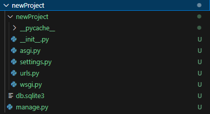

# Lets understand the Django Project Folder Structure

### After Creating the Project 'django-admin startproject newProject' we will see the below folder Structure.

### We also need to Create some more folders in the Base directory of our project
#### templates : This Folder contains the Html files which we render in our project.
#### static : This Folder contains all the static files like (css,js,fonts,images).
#### media: In this folder all the dynamic Files will be uploaded (for example: When Admin adds a new product which contains some images , that images will be uploaded inside media folder)

## UnderStanding Files
### manage.py file is a function used for running a program or migrating a program. It manages the program.
### db.sqlite3 is the default database used by django 
### views.py manages the urls of the project 
### Understanding settings.py File in newProject/newProject 
#### settings.py file is the main file which contains all the configuration of the project
#### BASE_DIR: It points to the top hierarchy of the project i.e.'DjangoBasicsToAdvance\newProject', whatever paths we define in the project are all relative to BASE_DIR.
#### SECRET_KEY: It is the unique key created while creating the project
#### DEBUG: In Development Error is very obvious to occur. There is no fun in writing a program where we do not face any error. but sometimes tackling errors is very hectic. Django provides an inbuilt Debugger which makes the developer’s life very easy. We can use it by doing: DEBUG = True (It is Default value and is preferred in only Development Phase.)In production, DEBUG = False is preferred.
#### ALLOWED_HOSTS: It is a list having addresses of all domains which can run your Django Project. for example ALLOWED_HOSTS=[“127.0.0.1”, “*.heroku.com”]. “127.0.0.1” represents Your PC, “*.heroku.com” represents this application can be run on heroku also. 
#### INSTALLED_APPS: In this section, we mention all apps that will be used in our Django project. By default there are some apps already mentioned, we can add new apps after creating it.
#### TEMPLATES: Point the Templates location in 'DIRS'
#### DATABASES: It stores configuration of the database by default db.sqlite3 is configured
#### URL Variables: URL variables are relative to BASE_DIR. These variables are used to store files either media or static.(STATIC_URL = '/static/', MEDIA_URL= '/media/')
#### ROOT Variables: ROOT variables are absolute paths. These variables are used to retrieve files either media or static.(MEDIA_ROOT= os.path.join(BASE_DIR, 'media'),STATIC_ROOT= os.path.join(BASE_DIR, 'static')) 
#### STATICFILES_DIRS: It is Additional locations of static files. (STATICFILES_DIRS =  [os.path.join(BASE_DIR, "app/static")])

 

