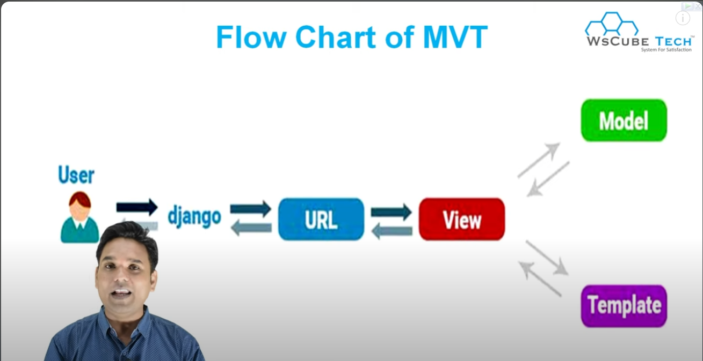

# Theories related to django

### What is Django?
##### Django is an open-source Python framework used for web/app development.
##### A framework is a set of rules, ideas, and beliefs which is used to deal with the problems and decide what to do.
##### Django enables rapid and quick development of web applications.
##### It is very fast,simple and secure. The secure and well-established feature of this framework makes it better. A packaging system is also available in Django
##### It works on Model View Template.

### What is Model View Template?
##### MVT is a software design pattern.
##### The model is going to act as the interface of your data.
##### The view is the user interface. It is the data that a user sees when a user renders a website.
##### It consists of static parts of HTML output, and some special part describes how the dynamic content is inserted in the program.

